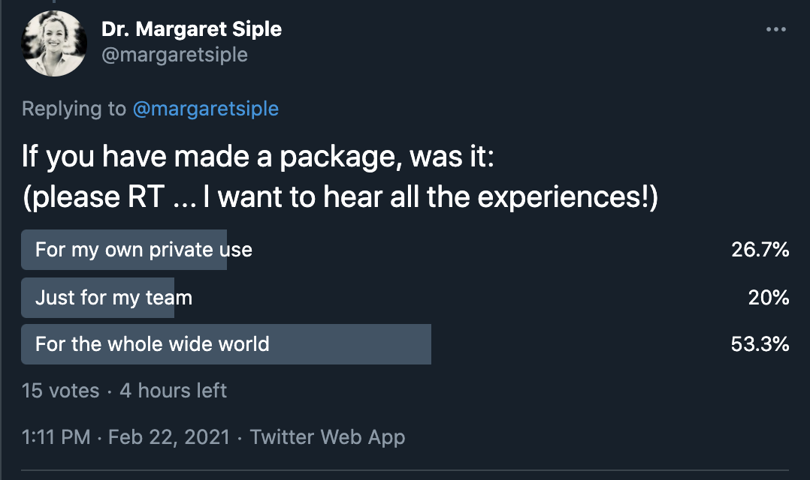
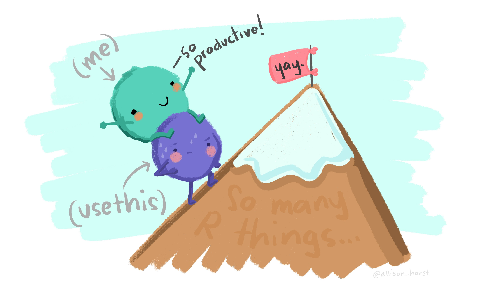

```{r setup, include=FALSE}
options(htmltools.dir.version = FALSE)
```

background-image: url(https://www.ghibli.jp/gallery/ponyo023.jpg)

???

Image credit: [Studio Ghibli](https://www.ghibli.jp/works/ponyo/#frame&gid=1&pid=23)

---
# What is a package?

- the fundamental unit of shareable code

```{r eval = FALSE}
# You install them like this:
install.packages("x")

# You load them like this:
library("x")

# ... and you can get help on them by using
package?x
# or
help("x")
```

---
# There are lots of ways to share code

  - email it to your collaborators

--

  - put it on a github repo and go nuts

--

  - ...other ways?
 
---
# ...so why packages?

--

- sharing reasons: easy for others to download, use, and learn about

--

- non-sharing reasons!

--

  - to organize your code
  
--

  - to make robust code that is less likely to break (yay!)


---
#Why do other people do it?

.center[]

---
# How do I do it?

---

.center[]
Image: Allison Horst


---

# Creating your first R package :)

```{r eval=FALSE}
library(usethis)
create_tidy_package("~/git_projects/mypackage")
```

---

# Creating your first R package :)

Once you `create_tidy_package()`, you will have a working directory that looks like this:

```
-- R
-- tests
-- DESCRIPTION
-- NAMESPACE
-- cran-comments.md
-- LICENSE.md
-- README.Rmd
-- README.md
```

---
# Creating your first R package
Set up a git repo for your package using `usethis`:

```{r eval=FALSE}
use_git()
use_github()
```

--

Once you've run the code above, all you have to do is run:
```{r eval=FALSE}
devtools::install_github("{github_username}/{packagename}")
```

.... and you can install your R package on a computer! 

---

# The most basic developer toolbox

**Setup** 

`{devtools}` 

`{usethis}` automates setup and other repetitive dev tasks

`{roxygen2}` writes documentation and formats it the way you need `r emo::ji("kiss")`


**Testing and checking** 

`{testthat}` performs tests

`{goodpractice}` automates checks for style AND content (e.g., outputs from `R CMD check`)


---
# Interested in package development?

- Some fun RStudio::global talks on package development

--

  - [You're Already Ready: Zen and the Art of Package Development](https://rstudio.com/resources/rstudioglobal-2021/youre-already-ready-zen-and-the-art-of-r-package-development/) by Malcolm Barrett

  - [Make a package - Make some friends](https://rstudio.com/resources/rstudioglobal-2021/make-a-package-make-some-friends/) by Athanasia M. Mowinckel

--

- Volunteer to be a reviewer for [rOpenSci](https://ropensci.org/software-review/)

---

# Thank you!

margaret.siple@noaa.gov

github: @mcsiple
